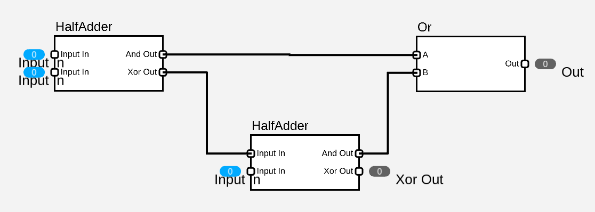

# 全加算器

次に全加算器を作ります。全加算器とは、半加算器に、前の桁の繰り上がりを入力出来るようにしたものです。半加算器と同様に、全加算器もFullAdderコンポーネントを作ります。

真理値表にすると以下のようになります。

| A   | B   | Cin | Cout | S   |
| --- | --- | --- | ---- | --- |
| 0   | 0   | 0   | 0    | 0   |
| 0   | 1   | 0   | 0    | 1   |
| 1   | 0   | 0   | 0    | 1   |
| 1   | 1   | 0   | 1    | 0   |
| 0   | 0   | 1   | 0    | 1   |
| 0   | 1   | 1   | 1    | 0   |
| 1   | 0   | 1   | 1    | 0   |
| 1   | 1   | 1   | 1    | 1   |

A, B, Cinが入力、Cout, Sが出力です。Cinは繰り上がりの入力を、Coutは繰り上がりの出力を表しています。

ここで、AとBを半加算器で足したときの出力を見てみましょう。

| A   | B   | C   | S   |
| --- | --- | --- | --- |
| 0   | 0   | 0   | 0   |
| 0   | 1   | 0   | 1   |
| 1   | 0   | 0   | 1   |
| 1   | 1   | 1   | 0   |

全加算器の真理値表の入力A, BをC, Sに置き換えてみます。

| C   | Sin | Cin | Cout | Sout |
| --- | --- | --- | ---- | ---- |
| 0   | 0   | 0   | 0    | 0    |
| 0   | 1   | 0   | 0    | 1    |
| 0   | 1   | 0   | 0    | 1    |
| 1   | 0   | 0   | 1    | 0    |
| 0   | 0   | 1   | 0    | 1    |
| 0   | 1   | 1   | 1    | 0    |
| 0   | 1   | 1   | 1    | 0    |
| 1   | 0   | 1   | 1    | 1    |

ここで、Soutは、SinとCinの和になっていることがわかります。その繰り上がりとCの論理和がCoutとなります。実際、Cが0かつSinとCinの和の繰り上がりが0の時、Coutは0、CまたはSinとCinの和の繰り上がりが1の時、Coutは1となっています。

以上から、全加算器は次のようになります。

